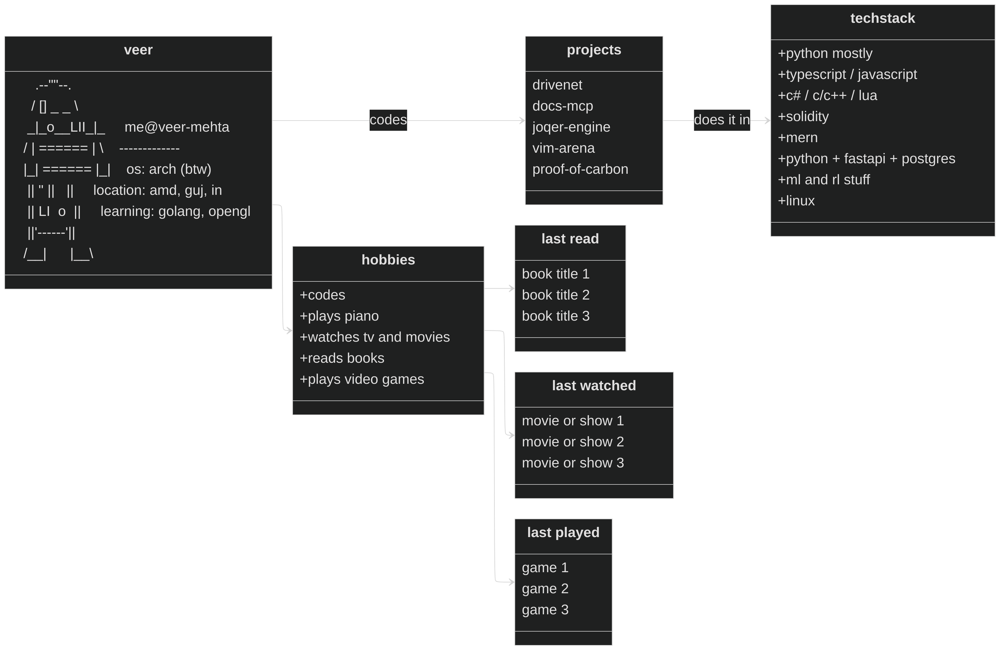

```mermaid
---
config:
  layout: elk
  theme: dark
  fontSize: 24
  themeCSS: "[id*=\"classId-veer\"] span, [id*=\"classId-veer\"] p { font-weight: 700; }"
  fontFamily: Consolas, Menlo, "DejaVu Sans Mono", monospace
  class:
    useMaxWidth: false
  state:
    useMaxWidth: false
  themeVariables:
    fontSize: 24px
    fontFamily: Consolas, Menlo, "DejaVu Sans Mono", monospace
---
classDiagram
    direction LR
    class veer {
        ​      .--#34;#34;--.   
        ​     / #91;#93; #95; #95; #92;  
        ​    #95;|#95;o#95;#95;LII#95;|#95;     me@veer-mehta
        ​   / | ====== | #92;    -------------
        ​   |#95;| ====== |#95;|    os#58; arch #40;btw#41;
        ​    || #34; ||   ||     location#58; amd, guj, in
        ​    || LI  o  ||     learning#58; golang, opengl
        ​    ||#39;------#39;|| 
        ​   /#95;#95;|      |#95;#95;#92;
    }
    class projects["projects"] {
        drivenet
        docs-mcp
        joqer-engine
        vim-arena
        proof-of-carbon
    }
    class hobbies["hobbies"] {
        +codes
        +plays piano
        +watches tv and movies
        +reads books
        +plays video games
    }
    class techstack["techstack"] {
        +python mostly
        +typescript / javascript
        +c# / c/c++ / lua
        +solidity
        +mern
        +python + fastapi + postgres
        +ml and rl stuff
        +linux
    }
    class lastread["last read"] {
        book title 1
        book title 2
        book title 3
    }
    class lastwatched["last watched"] {
        movie or show 1
        movie or show 2
        movie or show 3
    }
    class lastplayed["last played"] {
        game 1
        game 2
        game 3
    }

    veer --> projects : codes
    veer --> hobbies
    projects --> techstack : does it in
    hobbies --> lastread
    hobbies --> lastwatched
    hobbies --> lastplayed
```
