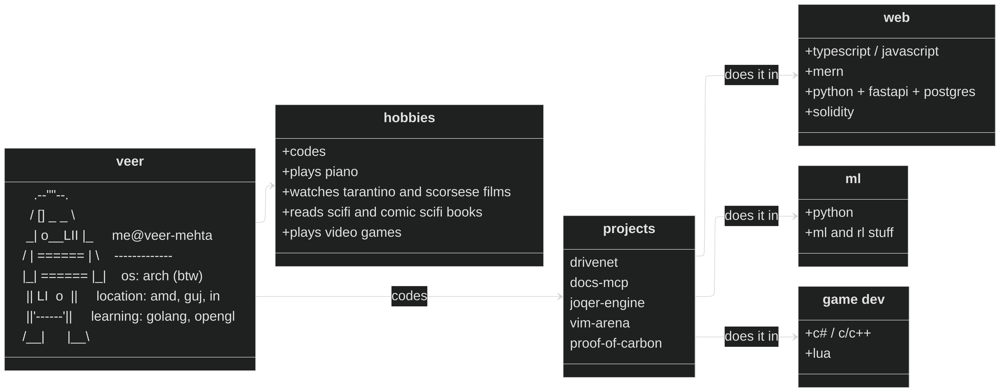

```mermaid
---
config:
  layout: elk
  theme: dark
  fontSize: 24
  themeCSS: "[id*=\"classId-veer\"] span, [id*=\"classId-veer\"] p { font-weight: 700; }"
  fontFamily: Consolas, Menlo, "DejaVu Sans Mono", monospace
  class:
    useMaxWidth: false
  state:
    useMaxWidth: false
  themeVariables:
    fontSize: 24px
    fontFamily: Consolas, Menlo, "DejaVu Sans Mono", monospace
---
classDiagram
    direction LR
    class veer {
        ​      .--#34;#34;--.   
        ​     / #91;#93; #95; #95; #92;  
        ​    #95;| o#95;#95;LII |#95;     me@veer-mehta
        ​   / | ====== | #92;    -------------
        ​   |#95;| ====== |#95;|    os#58; arch #40;btw#41;
        ​    || LI  o  ||     location#58; amd, guj, in
        ​    ||#39;------#39;||     learning#58; golang, opengl
        ​   /#95;#95;|      |#95;#95;#92;
    }
    class projects["projects"] {
        drivenet
        docs-mcp
        joqer-engine
        vim-arena
        proof-of-carbon
    }
    class hobbies["hobbies"] {
        +codes
        +plays piano
        +watches tarantino and scorsese films
        +reads scifi and comic scifi books
        +plays video games
    }
    class web["web"] {
        +typescript / javascript
        +mern
        +python + fastapi + postgres
        +solidity
    }
    class ml["ml"] {
        +python
        +ml and rl stuff
    }
    class gamedev["game dev"] {
        +c# / c/c++
        +lua
    }

    veer --> projects : codes
    veer --> hobbies
    projects --> web : does it in
    projects --> ml : does it in
    projects --> gamedev : does it in
```
